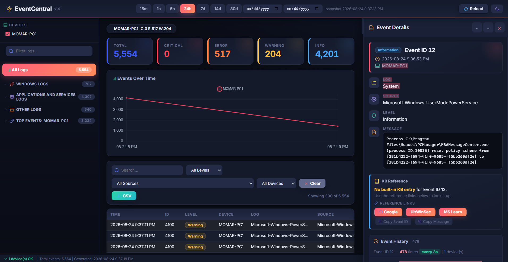

<div align="center">

# 📊 EventCentral

**Multi-Device Event Monitor**

Collect Windows Event Logs from your PC and remote servers (WinRM), archive them forever, and explore them in an interactive browser dashboard.


[Features](#-core-features) • [Usage](#-usage) • [Architecture](#️-architecture) • [Troubleshooting](#-troubleshooting)

</div>

---

# 📖 Overview

**EventCentral** is a multi-device Windows Event Log monitoring dashboard. It collects events from your PC and remote servers via WinRM, discovers **all** event logs, and displays them in an interactive browser dashboard. Events accumulate forever — every scan merges new events into the archive without deleting old data.

> ✅ No agents &nbsp;·&nbsp; ✅ No databases &nbsp;·&nbsp; ✅ No dependencies &nbsp;·&nbsp; 🔒 Your data stays on your machine

---

## 🖼️ Screenshots



*Dashboard: summary cards, per-device timeline chart, collapsible log tree, device health chips, and the sortable event table with Event History.*

---

# ✨ Core Features

### 🔹 Collection Engine
* **Incremental with catch-up** — every scan re-covers the look-back window; devices that fell behind start from their stored position, so no events are lost
* **Never deletes data** — `events.json` grows into a complete historical archive
* **Deduplication** — unique key `Time + EventID + Log + Machine + MD5(message hash)` prevents duplicates even for same-second events
* **Multi-device** — collect from localhost + remote servers via WinRM (`Invoke-Command`)
* **Full log discovery** — `Get-WinEvent -ListLog *` finds every log that contains events
* **Scan scope** — `Basic` (standard logs) / `Advanced` (+ service logs) / `All` (every log)
* **Friendly remote errors** — ACCESS DENIED / WINRM NOT ENABLED / TIMEOUT / NETWORK ERROR classified automatically
* **Resilient merge** — failed devices keep their scan position, so their missed window is re-collected next run

### 🔹 Dashboard
* **Summary cards** — Total / Critical / Error / Warning / Info
* **Unified time filter** — `15m / 1h / 6h / 24h / 7d / 14d / 30d` presets + custom date pickers
* **Timeline chart** — multi-line Chart.js, events per hour per device, hover-to-filter & click-to-pin
* **Sortable + filterable table** with infinite scroll
* **Dynamic Levels filter** — dropdown only shows levels present in the data, in canonical order
* **Sidebar** — collapsible log tree matching the Event Viewer layout, with live search
* **Device health** — color-coded chips 🟢 Green / 🟠 Orange / 🔴 Red based on thresholds
* **Cross-device shared events** — detect the same Event ID across multiple devices
* **Event History** — click any event to see ALL its past occurrences (chart + average recurrence interval)
* **KB reference** — ~70 built-in entries for common Windows Event IDs
* **Dark / Light theme** — persists via `localStorage`
* **CSV export** — download filtered events
* **Keyboard shortcuts** — `Ctrl+F` Search · `Ctrl+E` Export · `Esc` Close

### 🔹 Data & Storage
* **`events.json` is the database** — the dashboard reads it first and updates live
* **Embedded snapshot** — the HTML mirrors the archive so it also works offline from disk (`file://`)
* **`last_scan.json`** — per-device scan state for incremental runs

---

# 🚀 Usage

```powershell
.\Run-EventCentral.ps1
```

Or double-click **Run-EventCentral.ps1** in File Explorer.

### Steps

1. **Configure Settings** — open `Run-EventCentral.ps1` and edit the `⚙️ YOUR SETTINGS` section (devices, hours, scope, thresholds)
2. **Run the Launcher** — collects events and opens the dashboard
3. **Explore** — filter by time, log, device, level; click any event for full details and history
4. **Export** — press `Ctrl+E` to download the filtered rows as CSV

### Configuration Examples

```powershell
# Monitor two remote servers, last 48 hours
.\Run-EventCentral.ps1 -ComputerNames SRV01,SRV02 -Hours 48

# More events per log, advanced scope
.\Run-EventCentral.ps1 -ScanScope Advanced -MaxEventsPerLog 1000

# Skip updating the dashboard HTML
.\Run-EventCentral.ps1 -SkipRefresh

# Custom health thresholds
.\Run-EventCentral.ps1 -CriticalThreshold 3 -ErrorThreshold 10
```

> ⚙️ Any option passed on the command line overrides the value in the settings section.

---

# ⚙️ Requirements

| Requirement | Details |
|-------------|---------|
| **OS** | Windows 10 / 11 / Server 2016+ |
| **PowerShell** | 5.1 or later |
| **Permissions** | Administrator (for the Security log + remote scans) |
| **Remote servers** | WinRM enabled: `Enable-PSRemoting -Force` |
| **Browser** | Modern browser (Chrome, Edge, Firefox) |
| **Network** | Internet needed once for Google Fonts + Chart.js CDN |

---

# 🏗️ Architecture

```text
EventCentral-Dashboard/
├── Run-EventCentral.ps1           # Launcher + config (edit this one)
├── EventCentral-Collector.ps1     # Collection engine
├── EventCentral-Dashboard.html    # Interactive dashboard UI
├── events.json                    # Event archive (generated)
├── last_scan.json                 # Scan state (generated)
└── README.md                      # This file
```

### Data Flow

```text
Devices (local + WinRM)
        │
        ▼
EventCentral-Collector.ps1 ────► events.json ◄──── (database)
        │                              │
        └──► EventCentral-Dashboard.html ──► Browser
             (embedded snapshot for file://,
              live fetch for http://)
```

### Auto-Detection Behavior

* **Log discovery** — every log containing events is found automatically via `Get-WinEvent -ListLog *`
* **Device default** — if no devices are configured, the local machine is used
* **Level mapping** — numeric event levels map to friendly names (Critical / Error / Warning / Information / Verbose)
* **Machine name normalization** — DNS suffixes are stripped and names uppercased, so `pc-1.corp.local` and `PC-1` resolve to the same device
* **Dashboard refresh** — when enabled, fresh data is injected into the HTML automatically after each collection

---

# 🔍 Troubleshooting

| Symptom | Likely Cause | Fix |
|---------|--------------|-----|
| Remote scan: ACCESS DENIED | Not running as Administrator | Run the launcher elevated |
| Remote scan: WINRM NOT ENABLED | Remoting off on the target | `Enable-PSRemoting -Force` on the target |
| Remote scan: TIMEOUT | Target offline or firewalled | `Test-NetConnection <host> -Port 5985` |
| Security log empty | Admin rights missing | Run elevated — the Security log requires admin |
| Dashboard shows old data | `-SkipRefresh` was used | Re-run without `-SkipRefresh`, or open the HTML to re-embed |
| Fonts/charts missing | No internet on first load | Chart.js + Google Fonts load from CDN once, then cache |

---

# 🛡 Operational Notes

* **Data privacy** — everything stays on your machine: `events.json`, the dashboard, and scan state are local files; no telemetry, no cloud
* **Admin scope** — run elevated only when needed (Security log + remote scans); the collector reads logs, it never modifies system state
* **WinRM hardening** — enable remoting only on trusted hosts and keep firewall rules scoped to your management subnet
* **Archive growth** — `events.json` grows forever by design; archive or rotate it periodically if disk space matters
* **Staging first** — test scan scope and thresholds on a pilot device before pointing it at production servers

---

## 👤 Author

**Mohammad Abdulkader Omar**  
GitHub: [@mabdulkadr](https://github.com/mabdulkadr)  
Website: [momar.tech](https://momar.tech)  

---

## 📜 License

This project is licensed under the [MIT License](LICENSE).

---

## ⚠ Disclaimer

This skill and every script it generates are provided as-is with no warranty
of any kind. Test generated tools in a staging environment before deploying to
production. The authors assume no liability for any damage or data loss
resulting from their use.

---

<div align="center">

⭐ **If this tool saves you time, star the repo — it helps others find it.**

[Report an Issue](../../issues) · [momar.tech](https://momar.tech)

[](https://www.buymeacoffee.com/mabdulkadrx)

Built with [**PowerShell Enterprise Admin**](https://github.com/mabdulkadr/powershell-enterprise-admin-skill)

</div>
